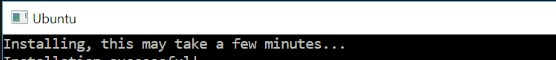
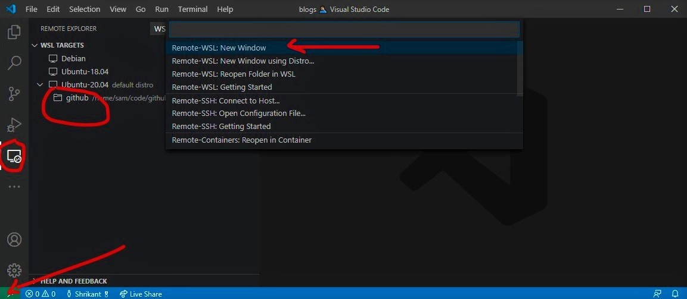
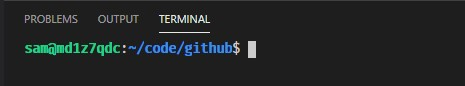
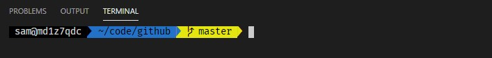

# <span style="color:#c89666; align:center">Setup Linux development on Windows using WSL and vscode</span>
## Setup WSL (Windows Subsystem for Linux):
- Enable WSL: (<a href="https://docs.microsoft.com/en-us/windows/wsl/install-win10">microsoft docs</a>)
    - Run this in powershell in elivated rights: 
    ``` powershell
    Enable-WindowsOptionalFeature -Online -FeatureName Microsoft-Windows-Subsystem-Linux
    ```
- Download the linux distro of your choice (Office sites)
    - open powershell prompt.
    - cd to your favorite directory and `mkdir wsl-app && cd wsl-app`
    - run the following set of command on after another. (it will install ubuntu 2004 use <a href="https://docs.microsoft.com/en-us/windows/wsl/install-manual#downloading-distros">this</a> to check how you can install other distros )
    ``` powershell
    Invoke-WebRequest -Uri https://aka.ms/wslubuntu2004 -OutFile Ubuntu.appx -UseBasicParsing
    Add-AppxPackage .\Ubuntu.appx

    ```
- once you complete the abouve steps you should see a new 'app' name ubuntu in you start menu
- 
- open this app and you should see a command promt asking you to wait a few minutes.
- 
- at this point go ahead grab cup of coffee as it **Will take a few minutes**
- are you back? how was the coffee?
- next it'll ask you for a username and password, provide those.
- a quick point here: keep you username short, your terminal will nice with sort username.
- **With this wsl is installed on your machine.**
- before we continue: running following command are optional but are highly recommended 
``` bash
sudo apt udpate
sudo apt upgrade
```
- this will also take some time.

## Setup node on Ubuntu:
- the easist way to do this is through: nvm (node version manager)
- you know the drill:
``` bash
sudo apt-get install curl
curl -o- https://raw.githubusercontent.com/nvm-sh/nvm/v0.35.3/install.sh | bash
```
- to verify installation, enter: `command -v nvm` ...this should return 'nvm', if you receive 'command not found' or no response at all, close your current terminal, reopen it, and try again.

``` bash
nvm install node
nvm ls
npm --version
```
- **done**

## WSL and VSCode integration:
- go ahead and install: <a href="https://marketplace.visualstudio.com/items?itemName=ms-vscode-remote.vscode-remote-extensionpack">Remote Development</a> extension pack for vscode.
- once done vscode will look like this:\

- at this point, click on remove windows icon at the botton left cornor:
- select `Remote-WLS: New Window`
- this will setup vs code for remote development: you can learn more about it <a href="https://docs.microsoft.com/en-us/windows/wsl/tutorials/wsl-vscode#from-vs-code">here</a>.
- **done**

## Setting up bash in VS code:
- Open terminal in vscode: `(Ctrl+)`
- and you are running linux bash inside vscode
- try this `lsb_release --a`
- **done**

## Now for the fun part:
- we'll go from terminal looking like this:\

- to looking like this:\

- go ahead and execute these commands:
``` bash
sudo apt install zsh
sh -c "$(curl -fsSL https://raw.githubusercontent.com/ohmyzsh/ohmyzsh/master/tools/install.sh)"
sudo apt-get install fonts-powerline
```
- once this is done you are almost done.
- next select zsh in vscode as default terminal.